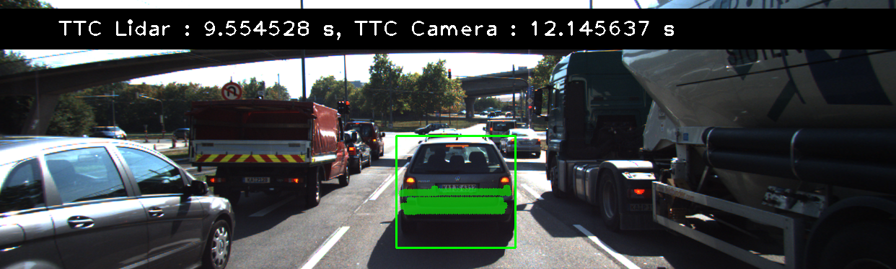

# SFND 3D Object Tracking

Welcome to the final project of the camera course. By completing all the lessons, you now have a solid understanding of keypoint detectors, descriptors, and methods to match them between successive images. Also, you know how to detect objects in an image using the YOLO deep-learning framework. And finally, you know how to associate regions in a camera image with Lidar points in 3D space. Let's take a look at our program schematic to see what we already have accomplished and what's still missing.


In this final project, you will implement the missing parts in the schematic. To do this, you will complete four major tasks: 
1. First, you will develop a way to match 3D objects over time by using keypoint correspondences. 
2. Second, you will compute the TTC based on Lidar measurements. 
3. You will then proceed to do the same using the camera, which requires to first associate keypoint matches to regions of interest and then to compute the TTC based on those matches. 
4. And lastly, you will conduct various tests with the framework. Your goal is to identify the most suitable detector/descriptor combination for TTC estimation and also to search for problems that can lead to faulty measurements by the camera or Lidar sensor. In the last course of this Nanodegree, you will learn about the Kalman filter, which is a great way to combine the two independent TTC measurements into an improved version which is much more reliable than a single sensor alone can be. But before we think about such things, let us focus on your final project in the camera course. 

## Dependencies for Running Locally
* cmake >= 2.8
  * All OSes: [click here for installation instructions](https://cmake.org/install/)
* make >= 4.1 (Linux, Mac), 3.81 (Windows)
  * Linux: make is installed by default on most Linux distros
  * Mac: [install Xcode command line tools to get make](https://developer.apple.com/xcode/features/)
  * Windows: [Click here for installation instructions](http://gnuwin32.sourceforge.net/packages/make.htm)
* Git LFS
  * Weight files are handled using [LFS](https://git-lfs.github.com/)
* OpenCV >= 4.1
  * This must be compiled from source using the `-D OPENCV_ENABLE_NONFREE=ON` cmake flag for testing the SIFT and SURF detectors.
  * The OpenCV 4.1.0 source code can be found [here](https://github.com/opencv/opencv/tree/4.1.0)
* gcc/g++ >= 5.4
  * Linux: gcc / g++ is installed by default on most Linux distros
  * Mac: same deal as make - [install Xcode command line tools](https://developer.apple.com/xcode/features/)
  * Windows: recommend using [MinGW](http://www.mingw.org/)

## Basic Build Instructions

1. Clone this repo.
2. Make a build directory in the top level project directory: `mkdir build && cd build`
3. Compile: `cmake .. && make`
4. Run it: `./3D_object_tracking`.

----

## FP.1 Match 3D Objects

**Objective**: Implement the method "matchBoundingBoxes", which takes as input both the previous and the current data frames and provides as output the IDs of the matched regions of interest (i.e. the boxID property). Matches must be the ones with the highest number of keypoint correspondences.

**Approach**: My approach to implement the `matchBoundingBoxes()` function is to map the bounding box from one video frame to another, then we loop through each match and set the bounding box ID for the previous and the current frame *only* when the keypoints must be inside the bounding box. That is for each bounding box in the previous frame and current frame, store the bounding box ID if the keypoint is enclosed within region of interest (ROI) using `bbox.roi.contains(kpt.pt)` to evaluate true/false.

Once the previous and current bounding box ID is found then store them in a (C++ STL) `multimap` structure. The current bounding box ID and previous bounding box ID will be store as a <key,value> pair in the multimap. In order to find the most likely matching bounding box for the previous and current frame, we can
create a list of bounding box IDs for current frame, which will be used for constructing the best matching bounding box match pair `bbBestMatches`.

Then we loop through each boxID in the current frame and get associated boxID for the previous frame that has the highest counts.

At the end insert the best matching bounding box pair {prevFrameBoxID, currFrameBoxID} for each bounding box in current frame to `bbBestMatches`.

## FP.2 Compute Lidar-based TTC

**Criteria**: Compute the time-to-collision in second for all matched 3D objects using only Lidar measurements from the matched bounding boxes between current and previous frame.

**Objective**: My approach to calculate the Lidar-based TTC is based on the CVM (Constant Velocity Model) formula, which is `TTC = d1 * (1.0 / frameRate) / (d0 - d1)`, where `d0` and `d1` are the median  values of the Lidar points in the vehicle driving direction (i.e. x-axis) in the previous and current frame, rather than the using the closest Lidar points in the x-axis to minimize the variations of the noisy lidar measurements.

Note to find the median value of the Lidar points along x-axis, the `lidarPointsPrev`, `lidarPointsCurr`, a custom `sortLidar_X()` function is created to sort the Lidar point along x-axis in ascending order.

## FP.3 Associate Keypoint Correspondences with Bounding Boxes

**Objective**: Prepare the TTC computation based on camera measurements by associating keypoint correspondences to the bounding boxes which enclose them. All matches which satisfy this condition must be added to a vector in the respective bounding box.

**Approach**: My approach to associate the keypoint corresondences with bounding boxes is as follows:

1. Add keypoints matches of the current frame only if they are enclosed within the bounding box
2. Calculate the average Euclidean distance between the previous and current key points that are enclosed in the bounding box.
3. Calculate the mMean Euclidean distances amongst all matches
4. For each keypoint matchines in the bounding box, remove outlier matches when the Euclidean distance of the match is above the threshold `outliersThreshold=1.5` of the mean Euclidean distance

## FP.4 Compute Camera-based TTC

**Objective**: Compute the time-to-collision in second for all matched 3D objects using only keypoint correspondences from the matched bounding boxes between current and previous frame.

**Approach**: My approach to compute the camera-based TTC is based on the median value of the distance ratio of the preceding vehicle over a time step. 

1. Calculate the distance ratios between all matched keypoints by first getting the Euclidean distance current keypoint and its matched partner in the prev. frame, as well as the next keypoint and its matched partner in the prev. frame.

For example:

```cpp
double distPrev = cv::norm(kptOuterPrev.pt - kptInnerPrev.pt);
double distCurr = cv::norm(kptOuterCurr.pt - kptInnerCurr.pt);
```

2. Then sort the distance ratio in ascending order, find the median distance ratio to remove outlier influence

3. Finally apply the camera-based TTC from distance ratios formula to calculate the TTC.

```cpp
// Compute camera-based TTC from distance ratios
double dT = 1.0 / frameRate;
TTC = -dT / (1 - medDistRatio);
```

## FP.5 Performance Evaluation 1

**Objective**: Find examples where the TTC estimate of the Lidar sensor does not seem plausible. Describe your observations and provide a sound argumentation why you think this happened.

### Examples of Lidar-based TTC implausible estimation (without additional logics for improving Lidar-based TTC robustness)

Below is the results of the Time-To-Collision (TTC) frame-by-frame analysis using `AKAZE` detector with the `ORB` descriptor with `MAT_BF` (brute-force) matcher and `SEL_NN` select nearest neighbour method on Udacity's starter code, which has a minimum Lidar point cloud processing: basic cropping of Lidar points and taking the closest x-value of the point as the input to the TTC calculation.

```

-------------------------------------
Camera Object detection configuration
-------------------------------------
- Detector   = AKAZE
- Descriptor = ORB
- Matcher    = MAT_BF
- Selector   = SEL_NN

-----------------------------------------------------------------------------
 Time-To-Collision (TTC) frame analysis 
 TTC calculation updates every 0.1 s

 * indicates if the TTC is negative or it is 10% greater than the last frame
-----------------------------------------------------------------------------
Frame #   1 -  TTC Lidar: 12.972159s,  TTC Camera : 13.402956s   Est. error: 3%
Frame #   2 -  TTC Lidar: 12.264038s,  TTC Camera : 14.289965s   Est. error: 15%
Frame #   3 - *TTC Lidar: 13.916132s,  TTC Camera : 13.789529s   Est. error: 1%     <-- Frame 3 (Condition: not decreasing monotonically)
Frame #   4 -  TTC Lidar:  7.115722s,  TTC Camera : 14.783032s   Est. error: 70%
Frame #   5 - *TTC Lidar: 16.251088s,  TTC Camera : 16.057552s   Est. error: 1%     <-- Frame 5 (Condition: not decreasing monotonically)
Frame #   6 -  TTC Lidar: 12.421338s,  TTC Camera : 13.890458s   Est. error: 11%
Frame #   7 - *TTC Lidar: 34.340420s, *TTC Camera : 15.605360s   Est. error: 75%    <-- Frame 7 ((Condition: not decreasing monotonically)
Frame #   8 -  TTC Lidar:  9.343759s,  TTC Camera : 14.255249s   Est. error: 42%
Frame #   9 - *TTC Lidar: 18.131756s,  TTC Camera : 13.665328s   Est. error: 28%    <-- Frame 9 (Condition: not decreasing monotonically)
Frame #  10 -  TTC Lidar: 18.031756s,  TTC Camera : 11.331379s   Est. error: 46%
Frame #  11 -  TTC Lidar:  3.832443s,  TTC Camera : 12.367197s   Est. error: 105%
Frame #  12 - *TTC Lidar: -10.853745s,  TTC Camera : 12.145637s   Est. error: 3561% <-- Frame 12 (Condition: negative value)
Frame #  13 - *TTC Lidar:  9.223069s,  TTC Camera : 10.830024s   Est. error: 16%
Frame #  14 - *TTC Lidar: 10.967763s,  TTC Camera : 10.459322s   Est. error: 5%     <-- Frame 14 (Condition: not decreasing monotonically)
Frame #  15 -  TTC Lidar:  8.094218s,  TTC Camera :  9.797382s   Est. error: 19%
Frame #  16 -  TTC Lidar:  3.175354s,  TTC Camera : 10.218116s   Est. error: 105%
Frame #  17 - *TTC Lidar: -9.994236s,  TTC Camera :  8.703067s   Est. error: 2896%  <-- Frame 17 (Condition: negative value)
Frame #  18 - *TTC Lidar:  8.309779s,  TTC Camera :  8.920069s   Est. error: 7%
```


### Condition 1: The TTC value should never be negative

The TTC value should never be negative as the TTC is predicting the time in the future. Referring to the CVM (Constant Velocity Model) TTC formula we used `TTC = d1 * (1.0 / frameRate) / (d0 - d1)`, it means that in order to result a negative value that the d1 must be greater than d0. In other words, the distance measured to the preceedinge vehicle in the previous frame is smaller than the current frame.

Given the KITI dataset used in this project, the preceding vehicle is stationary, therefore it is likely the error is due to the noisy Lidar sensor measurements. One possible workaround is to take the median value of the lidar points in x-axis rather than the closest x-value of the lidar poitns.

### Condition 2: The TTC value should decrease monotonically (for this dataset only)

The TTC value should decrease monotonically. For the same reason above, given the KTTI dataset used in the project, the prceeding vehicle ahead of the ego vehicle is stationary, therefore the TTC value in current frame should not be larger than the previous frame at any time.

#### Potential ways to improve robustness of Lidar-based TTC estimation

Here are the results of more reliable Lidar-based TTC estimation




by using these techniques to improve the robustness of the TTC estimation using Lidar measuremnts:

1. Crop the lidar points in ego lane

```cpp
// Crop Lidar points for the ego lane
void cropLidarPointsEgoLane(std::vector<LidarPoint> &lidarPoints, double laneWidth)
{    
    vector<LidarPoint> newLidarPts;
    for(auto it=lidarPoints.begin(); it!=lidarPoints.end(); ++it)
    {
        if (abs(it->z) <= laneWidth / 2.0)
            newLidarPts.push_back(*it);
    }

    lidarPoints = newLidarPts;
}
```

Exclude the lidar points outside the ego lane (i.e. +/- 2meters in the y-axis). This effectively eliminates unnecessary objects that are outside the region of interest (ROI).

2. Crop the lidar points above the bumper (avoids the noisy high reflective lidar points from the license plate)

```cpp
// Crop Lidar points above the bumper
void cropLidarPointsAboveBumper(std::vector<LidarPoint> &lidarPoints)
{
    // Percentage of Lidar poitns to be ignored 
    // that are below the lower portion of the bumper 
    const double pct_lowerBumper = 0.15;

    // Find the local min and max Z-value of Lidar point clouds
    double maxZ = -1;
    double minZ = 1e8;
    for(auto it=lidarPoints.begin(); it!=lidarPoints.end(); ++it)
    {
        maxZ = max((*it).z,maxZ);
        minZ = min((*it).z,minZ);
    }

    double above_bumper_Z = (maxZ - minZ)*pct_lowerBumper + minZ;
    // cout << "maxZ : " << maxZ << endl;
    // cout << "minZ : " << minZ << endl;
    // cout << "above_bumper_Z : " << above_bumper_Z << endl;

    vector<LidarPoint> newLidarPts;
    for(auto it=lidarPoints.begin(); it!=lidarPoints.end(); ++it)
    {
        if ((*it).z >= above_bumper_Z)
            newLidarPts.push_back(*it);
    }

    lidarPoints = newLidarPts;
}
```
The condition that allows the TTC computation to execute should only run if the number of Lidar points exceeds`minLidarPtsForBb` threshold rather than allowing TTC calculation to be updated when the Lidar point size is greater than zero, which could pose problems for unreliable TTC calculations when the Lid

3. Take the median x-value instead of the closest x-value of the Lidar point from current and previous frame as `d0` and `d1` helps to minimize the risk of taking the outlier Lidar points because Lidar measurement points could be noisy

```cpp
// Sort Lidar points along x-axis
void sortLidar_X(std::vector<LidarPoint> &lidarPoints)
{
    sort(lidarPoints.begin(), lidarPoints.end(), [](LidarPoint a, LidarPoint b){return a.x < b.x;});
}

// Compute time-to-collision (TTC) based on Lidar measurements alone
void computeTTCLidar(std::vector<LidarPoint> &lidarPointsPrev,
                     std::vector<LidarPoint> &lidarPointsCurr, double frameRate, double &TTC)
{
    // Sort Lidar points in previous and current frame 
    // along x-axis in ascending order
    sortLidar_X(lidarPointsPrev);
    sortLidar_X(lidarPointsCurr);

    // Compute TTC using median of the Lidar points along x-axis 
    double d0 = lidarPointsPrev[lidarPointsPrev.size()/2].x;
    double d1 = lidarPointsCurr[lidarPointsCurr.size()/2].x;
    TTC = d1 * (1.0 / frameRate) / (d0 - d1);
}
```

4. Set minimum threshold `minLidarPtsForBb` for lidar points in the matching bounding box. This helps to reduce the risk of associating the Lidar sensor noisy to unintentionally allows the TTC computation.

```cpp
// Compute TTC for current match
// Only compute TTC if we have sufficent number of Lidar points for robust computation
if( currBB->lidarPoints.size() > minLidarPtsForBb && prevBB->lidarPoints.size() > minLidarPtsForBb )
{
    // Remove the Lidar points outliers below the bumper
    cropLidarPointsAboveBumper(prevBB->lidarPoints);
    cropLidarPointsAboveBumper(currBB->lidarPoints);

    // STUDENT ASSIGNMENT
    // TASK FP.2 -> Compute time-to-collision based on Lidar data (implement -> computeTTCLidar)
    double ttcLidar; 
    computeTTCLidar(prevBB->lidarPoints, currBB->lidarPoints, sensorFrameRate, ttcLidar);
    // EOF STUDENT ASSIGNMENT

    // STUDENT ASSIGNMENT
    // TASK FP.3 -> Assign enclosed keypoint matches to bounding box (implement -> clusterKptMatchesWithROI)
    // TASK FP.4 -> Compute time-to-collision based on camera (implement -> computeTTCCamera)
    double ttcCamera;
    clusterKptMatchesWithROI(*currBB, (dataBuffer.end() - 2)->keypoints, (dataBuffer.end() - 1)->keypoints, (dataBuffer.end() - 1)->kptMatches);    

    // Keep track of number of matches found within ROI
    matches_list.push_back(currBB->kptMatches.size());
 
    computeTTCCamera((dataBuffer.end() - 2)->keypoints, (dataBuffer.end() - 1)->keypoints, currBB->kptMatches, sensorFrameRate, ttcCamera);
    // EOF STUDENT ASSIGNMENT
    
    // Store the TTC results for each frame
    ttcLidar_list.push_back(ttcLidar);
    ttcCamera_list.push_back(ttcCamera);

} // EOF TTC computation
```

## FP.6 Performance Evaluation 2

**Objective**: Run several detector / descriptor combinations and look at the differences in TTC estimation. Find out which methods perform best and also include several examples where camera-based TTC estimation is way off. As with Lidar, describe the observations again and also look into potential reasons.

### Examples of camera-based TTC implausible estimation

Similar to the Lidar-based TTC esitmation, the camera-based TTC estimation is not plausible if it violates one of the following conditions:

- Condition 1: The TTC value should never be negative
- Condition 2: The TTC value should decrease monotonically (for this dataset only)

`BRISK_ORB_MAT_FLANN_SEL_NN`

Amongst all combinations of tested descriptors, the combination of`BRISK` detector and `ORB` matching descriptor yields one of least reliable camera-based TTC estimations, as shown in the Time-To-Collision (TTC) frame analysis below.

For example at frame 11, the estimated camera-based TTC is not plausible because the TTC increases rapidly from the last frame (i.e. changing from 17.46s to 268.48s). One possible reason for this observation is that the keypoint in the current frame was incorrectly mapped to the window of the truck.


```
-------------------------------------
Camera Object detection configuration
-------------------------------------
- Detector   = BRISK
- Descriptor = ORB
- Matcher    = MAT_FLANN
- Selector   = SEL_NN

-----------------------------------------------------------------------------
 Time-To-Collision (TTC) frame analysis 
 TTC calculation updates every 0.1 s

 * indicates if the TTC is negative or it is 10% greater than the last frame
-----------------------------------------------------------------------------
Frame #   1 -  TTC Lidar: 11.773391s,  TTC Camera : 36.862529s   Est. error: 103%
Frame #   2 -  TTC Lidar: 11.514532s,  TTC Camera : 17.264428s   Est. error: 40%
Frame #   3 -  TTC Lidar: 12.332880s, *TTC Camera : 21.230194s   Est. error: 53%
Frame #   4 - *TTC Lidar: 13.764989s,  TTC Camera : 17.462030s   Est. error: 24%
Frame #   5 -  TTC Lidar: 13.928632s, *TTC Camera : 268.483299s   Est. error: 180% <--------@Frame 5 (Condition: not decreasing monotonically)
Frame #   6 -  TTC Lidar: 11.728791s,  TTC Camera : 29.931450s   Est. error: 87%
Frame #   7 -  TTC Lidar: 10.818368s,  TTC Camera : 14.202971s   Est. error: 27%
Frame #   8 -  TTC Lidar:  8.954114s, *TTC Camera : 65.351707s   Est. error: 152%
Frame #   9 - *TTC Lidar: 11.619990s,  TTC Camera : 14.918669s   Est. error: 25%
Frame #  10 -  TTC Lidar: 10.254801s, *TTC Camera : 16.965819s   Est. error: 49%
Frame #  11 - *TTC Lidar: 11.983818s, *TTC Camera : 121.723750s   Est. error: 164% <--------@Frame 11 (Condition: not decreasing monotonically)
Frame #  12 -  TTC Lidar:  9.554528s,  TTC Camera : 11.992198s   Est. error: 23%
Frame #  13 -  TTC Lidar:  7.833339s, *TTC Camera : 14.527353s   Est. error: 60%
Frame #  14 -  TTC Lidar:  7.498943s, *TTC Camera : 25.332659s   Est. error: 109%
Frame #  15 -  TTC Lidar:  7.997775s,  TTC Camera : 13.223680s   Est. error: 49%
Frame #  16 -  TTC Lidar:  8.489138s, *TTC Camera : 15.812797s   Est. error: 60%
Frame #  17 -  TTC Lidar:  8.603669s, *TTC Camera : 28.468274s   Est. error: 107%
Frame #  18 -  TTC Lidar:  8.398803s,  TTC Camera : 12.062612s   Est. error: 36%
Frame #  19 -  TTC Lidar:  8.842841s, *TTC Camera : 14.309533s   Est. error: 47%
Frame #  20 -  TTC Lidar:  7.150011s,  TTC Camera : 12.302513s   Est. error: 53%
Frame #  21 -  TTC Lidar:  6.972647s,  TTC Camera : 11.786087s   Est. error: 51%
Frame #  22 -  TTC Lidar:  7.527554s, *TTC Camera : 13.859114s   Est. error: 59%
Frame #  23 -  TTC Lidar:  7.183359s,  TTC Camera : 12.927907s   Est. error: 57%
Frame #  24 -  TTC Lidar:  7.418608s,  TTC Camera : 13.634122s   Est. error: 59%
Frame #  25 -  TTC Lidar:  6.763446s,  TTC Camera : 14.451702s   Est. error: 72%
Frame #  26 - *TTC Lidar:  7.576805s, *TTC Camera : 65.844346s   Est. error: 159%
Frame #  27 -  TTC Lidar:  5.556357s,  TTC Camera : 15.177827s   Est. error: 93%
Frame #  28 - *TTC Lidar:  7.107056s,  TTC Camera : 13.973682s   Est. error: 65%
Frame #  29 -  TTC Lidar:  6.012123s, *TTC Camera : 32.101825s   Est. error: 137%
Frame #  30 - *TTC Lidar: 10.528528s,  TTC Camera : 28.538189s   Est. error: 92%
Frame #  31 -  TTC Lidar:  9.263462s,  TTC Camera : 19.899274s   Est. error: 73%
Frame #  32 -  TTC Lidar:  9.314547s,  TTC Camera : 15.083932s   Est. error: 47%
Frame #  33 -  TTC Lidar:  6.860226s, *TTC Camera : -51.947266s   Est. error: 261% <--------@Frame 33 (Condition: negative value)
Frame #  34 - *TTC Lidar:  9.727652s, *TTC Camera : 12.899674s   Est. error: 28%
Frame #  35 -  TTC Lidar:  7.529742s, *TTC Camera : 15.844559s   Est. error: 71%
Frame #  36 - *TTC Lidar:  9.040932s,  TTC Camera : 13.606935s   Est. error: 40%
Frame #  37 -  TTC Lidar:  6.793756s,  TTC Camera : 11.150283s   Est. error: 49%
Frame #  38 -  TTC Lidar:  5.750542s, *TTC Camera : 20.324666s   Est. error: 112%
Frame #  39 - *TTC Lidar:  6.758968s,  TTC Camera : 11.298595s   Est. error: 50%
Frame #  40 -  TTC Lidar:  5.758910s, *TTC Camera : 16.660344s   Est. error: 97%
Frame #  41 -  TTC Lidar:  5.663354s,  TTC Camera :  9.425700s   Est. error: 50%
Frame #  42 - *TTC Lidar:  6.271256s,  TTC Camera :  7.256336s   Est. error: 15%
Frame #  43 -  TTC Lidar:  5.882135s, *TTC Camera :  9.556611s   Est. error: 48%
Frame #  44 -  TTC Lidar:  5.395546s,  TTC Camera :  8.675785s   Est. error: 47%
Frame #  45 - *TTC Lidar:  6.743653s, *TTC Camera : 12.510189s   Est. error: 60%
Frame #  46 -  TTC Lidar:  7.276917s,  TTC Camera : 11.448133s   Est. error: 45%
Frame #  47 -  TTC Lidar:  7.301547s, *TTC Camera : 17.960132s   Est. error: 84%
Frame #  48 - *TTC Lidar:  8.562979s,  TTC Camera : 15.072582s   Est. error: 55%
Frame #  49 - *TTC Lidar: 15.320137s,  TTC Camera : 14.174317s   Est. error: 8%
Frame #  50 -  TTC Lidar: 13.414737s, *TTC Camera : 24.995100s   Est. error: 60%
```

- HARRIS_FREAK_MAT_BF_SEL_NN

An example of an unreliable camera-based TTC estimation was found when `HARRIS` detector and `FREAK` descriptor were used, in which an unexpected (large) negative TTC was calculated. Interesting it was observed that the `HARRIS` detector works well with other non-`FREAK` descriptor.

For example at frame 3, roof of the car was incorrectly mapped to the roof of the truck


```
-------------------------------------
Camera Object detection configuration
-------------------------------------
- Detector   = HARRIS
- Descriptor = FREAK
- Matcher    = MAT_BF
- Selector   = SEL_NN

-----------------------------------------------------------------------------
 Time-To-Collision (TTC) frame analysis 
 TTC calculation updates every 0.1 s

 * indicates if the TTC is negative or it is 10% greater than the last frame
-----------------------------------------------------------------------------
Frame #   1 -  TTC Lidar: 11.773391s,  TTC Camera :  9.749526s   Est. error: 19%
Frame #   2 -  TTC Lidar: 11.514532s, *TTC Camera : -0.519552s   Est. error: 219%
Frame #   3 -  TTC Lidar: 12.332880s, *TTC Camera : -80.852533s   Est. error: 272% <--------@Frame 3 (Condition: negative value)
Frame #   4 - *TTC Lidar: 13.764989s, *TTC Camera : 12.128391s   Est. error: 13%
Frame #   5 -  TTC Lidar: 13.928632s, *TTC Camera :      -infs   Est. error: nan%  <--------@Frame 5 (Condition: negative value)
Frame #   6 -  TTC Lidar: 11.728791s, *TTC Camera : 15.526773s   Est. error: 28%
Frame #   7 -  TTC Lidar: 10.818368s,  TTC Camera : 13.190481s   Est. error: 20%
Frame #   8 -  TTC Lidar:  8.954114s, *TTC Camera :      -infs   Est. error: nan%  <--------@Frame 8 (Condition: negative value)
Frame #   9 - *TTC Lidar: 11.619990s, *TTC Camera :  0.137835s   Est. error: 195%
Frame #  10 -  TTC Lidar: 10.254801s, *TTC Camera : 10.293108s   Est. error: 0%
Frame #  11 - *TTC Lidar: 11.983818s,  TTC Camera : 11.096724s   Est. error: 8%
Frame #  12 -  TTC Lidar:  9.554528s, *TTC Camera : 12.244994s   Est. error: 25%
Frame #  13 -  TTC Lidar:  7.833339s,  TTC Camera : 13.432725s   Est. error: 53%
Frame #  14 -  TTC Lidar:  7.498943s,  TTC Camera :  0.500813s   Est. error: 175% 
Frame #  15 -  TTC Lidar:  7.997775s, *TTC Camera : -12.639044s   Est. error: 889% <--------@Frame 16 (Condition: negative value)
Frame #  16 -  TTC Lidar:  8.489138s, *TTC Camera : 11.795396s   Est. error: 33%
Frame #  17 -  TTC Lidar:  8.603669s,  TTC Camera : 11.796385s   Est. error: 31%
Frame #  18 -  TTC Lidar:  8.398803s, *TTC Camera : 25.676266s   Est. error: 101%  <--------@Frame 18 (Condition: not decreasing monotonically)
Frame #  19 -  TTC Lidar:  8.842841s,  TTC Camera : 11.200889s   Est. error: 24%
Frame #  20 -  TTC Lidar:  7.150011s, *TTC Camera : 13.061724s   Est. error: 58%
Frame #  21 -  TTC Lidar:  6.972647s,  TTC Camera : 11.507576s   Est. error: 49%
Frame #  22 -  TTC Lidar:  7.527554s,  TTC Camera : 11.474632s   Est. error: 42%
Frame #  23 -  TTC Lidar:  7.183359s,  TTC Camera : 11.730639s   Est. error: 48%
Frame #  24 -  TTC Lidar:  7.418608s,  TTC Camera :  7.898043s   Est. error: 6%
Frame #  25 -  TTC Lidar:  6.763446s,  TTC Camera :  8.141306s   Est. error: 18%
Frame #  26 - *TTC Lidar:  7.576805s, *TTC Camera : 10.648098s   Est. error: 34%
Frame #  27 -  TTC Lidar:  5.556357s, *TTC Camera : 12.494148s   Est. error: 77%
Frame #  28 - *TTC Lidar:  7.107056s, *TTC Camera :      -infs   Est. error: nan%  <--------@Frame 28 (Condition: negative value)
Frame #  29 -  TTC Lidar:  6.012123s, *TTC Camera : 16.607052s   Est. error: 94%
Frame #  30 - *TTC Lidar: 10.528528s,  TTC Camera : 13.606593s   Est. error: 26%
Frame #  31 -  TTC Lidar:  9.263462s, *TTC Camera : -15.301351s   Est. error: 814% <--------@Frame 31 (Condition: negative value)
Frame #  32 -  TTC Lidar:  9.314547s, *TTC Camera : -13.268032s   Est. error: 1142%<--------@Frame 32 (Condition: negative value)
Frame #  33 -  TTC Lidar:  6.860226s, *TTC Camera : 14.867341s   Est. error: 74%
Frame #  34 - *TTC Lidar:  9.727652s, *TTC Camera : 84.143008s   Est. error: 159%  <--------@Frame 34
Frame #  35 -  TTC Lidar:  7.529742s, *TTC Camera :      -infs   Est. error: nan%  <--------@Frame 35 (Condition: negative value)
Frame #  36 - *TTC Lidar:  9.040932s, *TTC Camera : 12.491553s   Est. error: 32%
Frame #  37 -  TTC Lidar:  6.147134s,  TTC Camera :  8.354105s   Est. error: 30%
Frame #  38 -  TTC Lidar:  6.758968s, *TTC Camera : 11.900000s   Est. error: 55%
Frame #  39 -  TTC Lidar:  5.758910s,  TTC Camera :  5.987075s   Est. error: 4%
Frame #  40 -  TTC Lidar:  5.663354s, *TTC Camera : 11.931706s   Est. error: 71%
Frame #  41 - *TTC Lidar:  6.271256s,  TTC Camera : 12.715505s   Est. error: 68%
Frame #  42 -  TTC Lidar:  5.882135s,  TTC Camera : 12.452800s   Est. error: 72%
Frame #  43 -  TTC Lidar:  5.395546s, *TTC Camera : 16.569696s   Est. error: 102%
Frame #  44 - *TTC Lidar:  6.743653s,  TTC Camera : 12.519513s   Est. error: 60%
Frame #  45 -  TTC Lidar:  7.276917s, *TTC Camera : 17.811849s   Est. error: 84%
Frame #  46 -  TTC Lidar:  7.301547s, *TTC Camera : 277.887829s  Est. error: 190%  <--------@Frame 46 (Condition: not decreasing monotonically)
Frame #  47 - *TTC Lidar:  8.562979s,  TTC Camera : 18.103619s   Est. error: 72%
Frame #  48 - *TTC Lidar: 15.320137s,  TTC Camera : 19.164755s   Est. error: 22%
Frame #  49 -  TTC Lidar: 13.414737s, *TTC Camera : 59.789153s   Est. error: 127%  <--------@Frame 49 (Condition: not decreasing monotonically)

```

### Best method for the most reliable camera-based TTC estimations (AKAZE detector + ORB descriptor)

- `AKAZE_ORB_MAT_BF_SEL_NN`

For reliable TTC estimations, it was found that `AKAZE` is a great keypoint detector and is able to detect "strong" features in the frame such as taillight as detection keypoints. `AKAZE` detector detects 150 keypoints in 50ms and taking ~72ms to detect and match altogether

Note despite the count of detected keypoints of `AKAZE` could be *significantly* smaller when comparing one with the `ORB` detector, however this is not important and so long as there is sufficient number of keypoints for calculating a consistent camera-based TTC estimation. 

Below are the results of camera-based TTC estimations running of such configuration with the first 50 frames of the KITTI 2011_09_26\image_02 dataset.

```
-------------------------------------
Camera Object detection configuration
-------------------------------------
- Detector   = AKAZE
- Descriptor = ORB
- Matcher    = MAT_BF
- Selector   = SEL_NN

-----------------------------------------------------------------------------
 Time-To-Collision (TTC) frame analysis 
 TTC calculation updates every 0.1 s

 * indicates if the TTC is negative or it is 10% greater than the last frame
-----------------------------------------------------------------------------
Frame #   1 -  TTC Lidar: 11.773391s,  TTC Camera : 13.402956s   Est. error: 13%
Frame #   2 -  TTC Lidar: 11.514532s,  TTC Camera : 14.289965s   Est. error: 22%
Frame #   3 -  TTC Lidar: 12.332880s,  TTC Camera : 13.789529s   Est. error: 11%
Frame #   4 - *TTC Lidar: 13.764989s,  TTC Camera : 14.783032s   Est. error: 7%
Frame #   5 -  TTC Lidar: 13.928632s,  TTC Camera : 16.057552s   Est. error: 14%
Frame #   6 -  TTC Lidar: 11.728791s,  TTC Camera : 13.890458s   Est. error: 17%
Frame #   7 -  TTC Lidar: 10.818368s, *TTC Camera : 15.605360s   Est. error: 36%
Frame #   8 -  TTC Lidar:  8.954114s,  TTC Camera : 14.255249s   Est. error: 46%
Frame #   9 - *TTC Lidar: 11.619990s,  TTC Camera : 13.665328s   Est. error: 16%
Frame #  10 -  TTC Lidar: 10.254801s,  TTC Camera : 11.331379s   Est. error: 10%
Frame #  11 - *TTC Lidar: 11.983818s,  TTC Camera : 12.367197s   Est. error: 3%
Frame #  12 -  TTC Lidar:  9.554528s,  TTC Camera : 12.145637s   Est. error: 24%
Frame #  13 -  TTC Lidar:  7.833339s,  TTC Camera : 10.830024s   Est. error: 32%
Frame #  14 -  TTC Lidar:  7.498943s,  TTC Camera : 10.459322s   Est. error: 33%
Frame #  15 -  TTC Lidar:  7.997775s,  TTC Camera :  9.797382s   Est. error: 20%
Frame #  16 -  TTC Lidar:  8.489138s,  TTC Camera : 10.218116s   Est. error: 18%
Frame #  17 -  TTC Lidar:  8.603669s,  TTC Camera :  8.703067s   Est. error: 1%
Frame #  18 -  TTC Lidar:  8.398803s,  TTC Camera :  8.920069s   Est. error: 6%
Frame #  19 -  TTC Lidar:  8.842841s,  TTC Camera :  9.523541s   Est. error: 7%
Frame #  20 -  TTC Lidar:  7.150011s,  TTC Camera :  8.963309s   Est. error: 23%
Frame #  21 -  TTC Lidar:  6.972647s,  TTC Camera :  9.216095s   Est. error: 28%
Frame #  22 -  TTC Lidar:  7.527554s,  TTC Camera :  8.239129s   Est. error: 9%
Frame #  23 -  TTC Lidar:  7.183359s,  TTC Camera :  8.638720s   Est. error: 18%
Frame #  24 -  TTC Lidar:  7.418608s,  TTC Camera :  8.843494s   Est. error: 18%
Frame #  25 -  TTC Lidar:  6.763446s,  TTC Camera :  9.583631s   Est. error: 35%
Frame #  26 - *TTC Lidar:  7.576805s, *TTC Camera : 11.298542s   Est. error: 39%
Frame #  27 -  TTC Lidar:  5.556357s,  TTC Camera : 11.183295s   Est. error: 67%
Frame #  28 - *TTC Lidar:  7.107056s,  TTC Camera :  9.868241s   Est. error: 33%
Frame #  29 -  TTC Lidar:  6.012123s,  TTC Camera : 10.037155s   Est. error: 50%
Frame #  30 - *TTC Lidar: 10.528528s,  TTC Camera : 10.484635s   Est. error: 0%
Frame #  31 -  TTC Lidar:  9.263462s, *TTC Camera : 11.643539s   Est. error: 23%
Frame #  32 -  TTC Lidar:  9.314547s,  TTC Camera : 11.921112s   Est. error: 25%
Frame #  33 -  TTC Lidar:  6.860226s,  TTC Camera : 11.865137s   Est. error: 53%
Frame #  34 - *TTC Lidar:  9.727652s,  TTC Camera :  9.346587s   Est. error: 4%
Frame #  35 -  TTC Lidar:  7.529742s,  TTC Camera :  8.851506s   Est. error: 16%
Frame #  36 - *TTC Lidar:  9.040932s,  TTC Camera :  7.819561s   Est. error: 14%
Frame #  37 -  TTC Lidar:  6.793756s,  TTC Camera :  7.671687s   Est. error: 12%
Frame #  38 -  TTC Lidar:  5.750542s, *TTC Camera :  9.437254s   Est. error: 49%
Frame #  39 - *TTC Lidar:  6.758968s, *TTC Camera : 10.453565s   Est. error: 43%
Frame #  40 -  TTC Lidar:  5.758910s,  TTC Camera :  8.566549s   Est. error: 39%
Frame #  41 -  TTC Lidar:  5.663354s, *TTC Camera : 10.292603s   Est. error: 58%
Frame #  42 - *TTC Lidar:  6.271256s,  TTC Camera :  7.886538s   Est. error: 23%
Frame #  43 -  TTC Lidar:  5.882135s,  TTC Camera :  8.327708s   Est. error: 34%
Frame #  44 -  TTC Lidar:  5.395546s, *TTC Camera : 10.915974s   Est. error: 68%
Frame #  45 - *TTC Lidar:  6.743653s,  TTC Camera :  8.763087s   Est. error: 26%
Frame #  46 -  TTC Lidar:  7.276917s, *TTC Camera : 10.764803s   Est. error: 39%
Frame #  47 -  TTC Lidar:  7.301547s,  TTC Camera : 10.423816s   Est. error: 35%
Frame #  48 - *TTC Lidar:  8.562979s, *TTC Camera : 12.799152s   Est. error: 40%
Frame #  49 - *TTC Lidar: 15.320137s, *TTC Camera : 15.775638s   Est. error: 3%
Frame #  50 -  TTC Lidar: 13.414737s, *TTC Camera : 18.948772s   Est. error: 34%
```

### Quantity does not equal to quality

Interestingly despite `ORB` detector consistently yields the highest number of detected keypoints and keypoints matching amongst all detectors. But this does not necessary mean that it will always result in consistent reliable TTC results.

As most of the `ORB` keypoints are detecting weak features such as the preceeding car roof and a spot in the rear wind shield which location of such points could vary easiky from frame to frame. Futhermore multiple keypoints for the same weak feature are detected and therefore makes it even more difficult for the descriptors matching to achieve reliable TTC estimations.

### Best method for fastest camera-based TTC estimations with `FAST` detector (total execution time to detect and match 16ms, almost 7x faster than other tested detectors)

- FAST detector (+ ORB/BRIEF descriptor)

Amongst all of the tested detectors, `FAST` detector is the absolute fastest to detect the keypoints with typical around 1.19~1.25ms for keypoints detection and overall takes only about 16ms to complete the keypoints detection and matching. This is a *significant* advantage over any other detectors which typically takes about 50ms for the keypoints detection or 110ms to complete both detections and matching. In other words, `FAST` is almost 7x faster than the execution time of any other tested detectors (i.e. SHITOMASI, HARRIS, FAST, BRISK, ORB, AKAZE, SIFT).

In terms of the accuracy of the camera-based TTC estimation, it is somewhat similar to the results achieved by the `FAST` detectors but with slightly more variations of the TTC estimations across the frames. Also the distribution of detected keypoints are sparsely around the feature of the preceeding vehicle and the number of keypoints varies a lot across the frames.

Despite of being significant faster than any other detectors, the drawback of this detector is the variations of number of detected keypoints across frames, which leads to unreliable TTC estimations.

```
-------------------------------------
Camera Object detection configuration
-------------------------------------
- Detector   = FAST
- Descriptor = ORB
- Matcher    = MAT_BF
- Selector   = SEL_NN

-----------------------------------------------------------------------------
 Time-To-Collision (TTC) frame analysis 
 TTC calculation updates every 0.1 s

 * indicates if the TTC is negative or it is 10% greater than the last frame
-----------------------------------------------------------------------------
Frame #   1 -  TTC Lidar: 11.773391s,  TTC Camera : 11.054404s   Est. error: 6%
Frame #   2 -  TTC Lidar: 11.514532s,  TTC Camera : 10.635114s   Est. error: 8%
Frame #   3 -  TTC Lidar: 12.332880s, *TTC Camera : 13.400776s   Est. error: 8%
Frame #   4 - *TTC Lidar: 13.764989s,  TTC Camera : 12.513916s   Est. error: 10%
Frame #   5 -  TTC Lidar: 13.928632s, *TTC Camera : 24.644589s   Est. error: 56%
Frame #   6 -  TTC Lidar: 11.728791s,  TTC Camera : 13.250827s   Est. error: 12%
Frame #   7 -  TTC Lidar: 10.818368s,  TTC Camera : 12.464179s   Est. error: 14%
Frame #   8 -  TTC Lidar:  8.954114s,  TTC Camera : 11.352196s   Est. error: 24%
Frame #   9 - *TTC Lidar: 11.619990s,  TTC Camera : 12.111922s   Est. error: 4%
Frame #  10 -  TTC Lidar: 10.254801s, *TTC Camera : 13.416893s   Est. error: 27%
Frame #  11 - *TTC Lidar: 11.983818s,  TTC Camera : 13.417523s   Est. error: 11%
Frame #  12 -  TTC Lidar:  9.554528s,  TTC Camera : 10.423924s   Est. error: 9%
Frame #  13 -  TTC Lidar:  7.833339s, *TTC Camera : 12.046173s   Est. error: 42%
Frame #  14 -  TTC Lidar:  7.498943s,  TTC Camera : 11.010300s   Est. error: 38%
Frame #  15 -  TTC Lidar:  7.997775s,  TTC Camera : 11.384145s   Est. error: 35%
Frame #  16 -  TTC Lidar:  8.489138s,  TTC Camera : 11.372540s   Est. error: 29%
Frame #  17 -  TTC Lidar:  8.603669s,  TTC Camera :  7.567994s   Est. error: 13%
Frame #  18 -  TTC Lidar:  8.398803s, *TTC Camera : 10.391224s   Est. error: 21%
Frame #  19 -  TTC Lidar:  8.842841s,  TTC Camera :  9.701437s   Est. error: 9%
Frame #  20 -  TTC Lidar:  7.150011s, *TTC Camera : 11.214223s   Est. error: 44%
Frame #  21 -  TTC Lidar:  6.972647s,  TTC Camera : 10.720001s   Est. error: 42%
Frame #  22 -  TTC Lidar:  7.527554s,  TTC Camera : 11.287658s   Est. error: 40%
Frame #  23 -  TTC Lidar:  7.183359s,  TTC Camera :  8.826597s   Est. error: 21%
Frame #  24 -  TTC Lidar:  7.418608s,  TTC Camera :  8.464662s   Est. error: 13%
Frame #  25 -  TTC Lidar:  6.763446s, *TTC Camera : 10.750281s   Est. error: 46%
Frame #  26 - *TTC Lidar:  7.576805s,  TTC Camera :  9.286853s   Est. error: 20%
Frame #  27 -  TTC Lidar:  5.556357s, *TTC Camera : 14.355127s   Est. error: 88%
Frame #  28 - *TTC Lidar:  7.107056s,  TTC Camera : 11.785461s   Est. error: 50%
Frame #  29 -  TTC Lidar:  6.012123s,  TTC Camera : 11.465826s   Est. error: 62%
Frame #  30 - *TTC Lidar: 10.528528s,  TTC Camera : 12.514801s   Est. error: 17%
Frame #  31 -  TTC Lidar:  9.263462s, *TTC Camera : 14.493871s   Est. error: 44%
Frame #  32 -  TTC Lidar:  9.314547s,  TTC Camera : 13.650542s   Est. error: 38%
Frame #  33 -  TTC Lidar:  6.860226s,  TTC Camera : 14.603289s   Est. error: 72%
Frame #  34 - *TTC Lidar:  9.727652s,  TTC Camera : 10.560665s   Est. error: 8%
Frame #  35 -  TTC Lidar:  7.529742s,  TTC Camera :  9.512424s   Est. error: 23%
Frame #  36 - *TTC Lidar:  9.040932s,  TTC Camera :  8.664081s   Est. error: 4%
Frame #  37 -  TTC Lidar:  6.793756s,  TTC Camera :  8.357441s   Est. error: 21%
Frame #  38 -  TTC Lidar:  5.750542s, *TTC Camera : 10.441919s   Est. error: 58%
Frame #  39 - *TTC Lidar:  6.758968s,  TTC Camera :  9.742935s   Est. error: 36%
Frame #  40 -  TTC Lidar:  5.758910s,  TTC Camera :  7.902317s   Est. error: 31%
Frame #  41 -  TTC Lidar:  5.663354s,  TTC Camera :  7.486433s   Est. error: 28%
Frame #  42 - *TTC Lidar:  6.271256s,  TTC Camera :  6.790161s   Est. error: 8%
Frame #  43 -  TTC Lidar:  5.882135s,  TTC Camera :  7.234484s   Est. error: 21%
Frame #  44 -  TTC Lidar:  5.395546s, *TTC Camera :  8.150948s   Est. error: 41%
Frame #  45 - *TTC Lidar:  6.743653s,  TTC Camera :  8.303377s   Est. error: 21%
Frame #  46 -  TTC Lidar:  7.276917s, *TTC Camera : 10.774522s   Est. error: 39%
Frame #  47 -  TTC Lidar:  7.301547s,  TTC Camera : 10.337069s   Est. error: 34%
Frame #  48 - *TTC Lidar:  8.562979s, *TTC Camera : 12.515664s   Est. error: 38%
Frame #  49 - *TTC Lidar: 15.320137s,  TTC Camera : 13.450561s   Est. error: 13%
Frame #  50 -  TTC Lidar: 13.414737s, *TTC Camera : 18.278116s   Est. error: 31%
```
